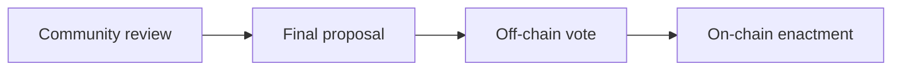
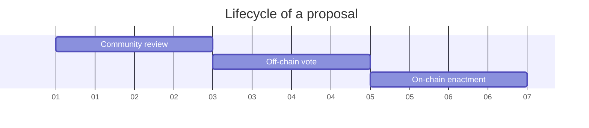

# Nation3 governance process

This document outlines the governance process that the Nation3 citizens, the members of the Meta Guild and the proposers must follow to engage with Nation3 governance.

## Kinds of proposals

- **Meta**: Proposal that modifies the current governance process (`specs/N3GOV-v1.ts` and `GOVERNANCE.md`).
- **Proclamation**: Proposal for the Nation3 DAO to adopt a statement.
  - Since multiple choices would be written in English and not encoded, this is the only kind of proposal on Snapshot that can use other voting systems other than _Single Choice_.
- **Expense**: Proposal to transfer an ERC20 token outside of the Nation3 DAO's treasury, with the expectation that it flows outside of its control.
- **Parameter change**: Proposal to perform a parameter change in one of the contracts controlled by the Nation3 DAO.
- **Treasury management proposal**: Proposal to perform an on-chain treasury management operation.
- **Custodial treasury management proposal**: Proposal to perform a treasury management operation, with the Nation3 DAO keeping the legitimate ownership over the assets but holding them through a third-party entity.

## Stages of a proposal

1. **Community review**: The community provides feedback on a published proposal for the proposer to consider. After the minimum duration required for this stage, the proposer can freeze their proposal, advancing it to the next stage. After freeze, any further modifications to the proposal require restarting the process.
   - **Duration**: >48h.
   - **Platform**: [Forum](https://forum.nation3.org).
2. **Off-chain vote**: Citizens can vote. The Meta Guild is responsible for creating the proposal on Snapshot.

   - **Duration**: 48h.
   - **Platform**: [Snapshot](https://snapshot.org/#/nation3.eth).
   - **Census**: All Nation3 citizens.
   - **Voting weight**: Token-weighted by $veNATION balance.
   - **Voting system**:
     - **Proclamation proposals**: _Single Choice_, _Approval_, _Ranked Choice_ or _Weighted_ as chosen by the proposer.
     - **All other kinds of proposals**: _Single Choice_.
   - **Voting threshold**: Simple majority.

3. **On-chain enactment**: $veNATION holders can ratify the proposal. The Meta Guild is responsible for creating the proposal on Aragon.
   - **Duration**: 48h.
   - **Platform**: [Aragon](https://client.aragon.org/#/nation3/0x92462953792d3e84af56edfc74d93e5885d38cc0/).
   - **Census**: All $veNATION holders.
   - **Voting weight**: Token-weighted by $veNATION balance.
   - **Voting system**: Binary (yes/no).
   - **Voting threshold**: Simple majority.

Census and voting weights are determined at the time of vote creation, both for the Nation3 space on Snapshot and the Nation3 DAO on Aragon. Nation3 passports and $veNATION are currently only on Ethereum.

## Sensitive proposals

The Nation3 DAO has an Agent app instance (called _Sensitive Agent_) governed by a Voting app with the following voting parameters:

- **Duration**: 168h (one full week).
- **Platform**: [Aragon]().
- **Census**: All $veNATION holders.
- **Voting weight**: Token-weighted by $veNATION balance.
- **Voting system**: Binary (yes/no).
- **Voting threshold**: >66% (supermajority) approval threshold with >20% participation rate.

Any proposal which would originate a transaction from the _Sensitive Agent_ app on the Nation3 DAO must be tagged as sensitive. All sensitive proposals follow the same governance process as standard proposals, but instead of 48h for each step in the process, it's 168h (a full week).

## Proposals Committee

The entities allowed to

Parameter change proposal can change them

## Glossary

- **Nation3 citizen**: Person holding a valid passport NFT issued by Nation3.
- **Meta Guild**:
