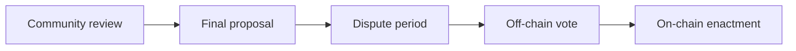
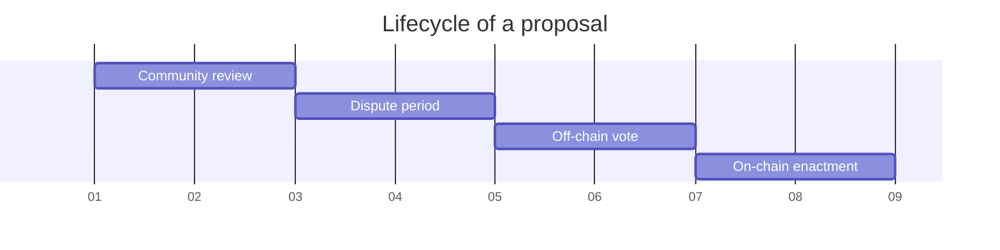

# Nation3 governance process

WIP, this document hasn't been adopted by the Nation3 DAO yet nor approved by the community.

## Principles

## Types of proposals

- **Meta**: Proposal that affects the governance process itself (either this file or GOVERNANCE.md).
- **Proclamation**: Proposal for the Nation3 DAO to adopt a statement.
- **Expense**: Proposal to transfer an ERC20 token outside of the Nation3 DAO's treasury, with the expectation that it flows outside of its control.
- **Parameter change**: Proposal to perform a parameter change in one of the contracts owned by the Nation3 DAO.
- **Custodial treasury management proposal**: Proposal to perform a treasury management operation, with the Nation3 DAO keeping the ultimate custody of the funds.
- **Non-custodial treasury management proposal**: Proposal to perform a treasury management operation, with the Nation3 DAO temporarily losing the ultimate custody of the funds.

## Stages of a proposal

1. **Community review**: The community provides feedback on a published proposal. The proposer can use such feedback to refine their proposal. After the minimum time needed for this stage, the proposer might freeze their proposal, advancing it to the next stage. From this point on any modifications to the proposal require restarting the process.
   - Duration: >48h
   - Platform: [Forum](https://forum.nation3.org)
2. **Dispute period**: Citizens might dispute the proposal if they deem it unconstitutional.
   - Duration: 48h
   - Platform: [Court](https://court.nation3.org)
3. **Off-chain vote**: Citizens can vote. The Governance Guild is responsible for creating the proposal on Snapshot.
   - Duration: 48h
   - Platform: [Snapshot](https://snapshot.org/#/nation3.eth)
4. **On-chain enactment**: $veNATION holders can ratify the proposal. The Governance Guild is repsonsible for creating the proposal on Aragon.
   - Duration: 48h
   - Platform: [Snapshot](https://snapshot.org/#/nation3.eth)

## Voting census

WIP (the voting census is constituted by the Nation3 citizens)

## Voting mechanisms and parameters

WIP
