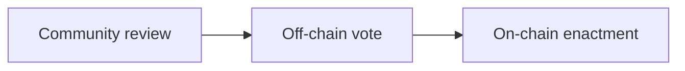
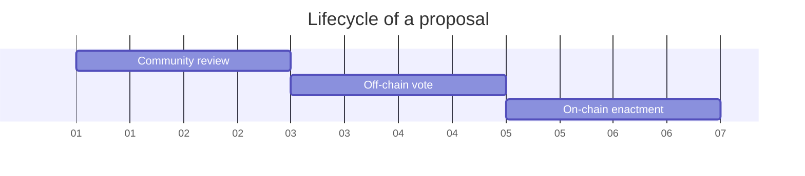

# Nation3 governance process

This document outlines the governance process that the Nation3 citizens, the Meta Guild multisig and the proposers must follow to engage with Nation3 governance.
This document adheres to the [Nation3
Constitution](https://linked.md/v?u=ipfs://bafybeidfupkrpzch3gwryqnaevratjc2nabhfoibygn5mmdpaylzbmajqu/Constitution.linked.md).

## Kinds of proposals

The different kinds of proposals are specified in the [Nation3 Constitution](https://linked.md/v?u=https://linked.md/api/github/nation3/law/main/Constitution.linked.md#Meta%20Proposal)

## Stages of a proposal

1. **Community review**: The community provides feedback on a published proposal for the proposer to consider. The proposer must explain how the proposal helps Nation3 advance its North Star metrics. After the minimum duration required for this stage, the proposer can freeze their proposal, advancing it to the next stage. After freeze, any further modifications to the proposal require restarting the process.
   - **Duration**: >48h.
   - **Platform**: [Forum](https://forum.nation3.org).
2. **Off-chain vote**: Citizens can vote. The Meta Guild is responsible for creating the proposal on Snapshot.

   - **Duration**: 48h.
   - **Platform**: [Snapshot](https://snapshot.org/#/nation3.eth).
   - **Census**: All Nation3 citizens.
   - **Voting weight**: Token-weighted by $veNATION balance.
   - **Voting system**: _Single Choice_.
   - **Voting threshold**: Simple majority.

3. **On-chain enactment**: $veNATION holders can ratify the proposal. The Meta Guild is responsible for creating the proposal on Aragon.
   - **Duration**: 48h.
   - **Platform**: [Aragon](https://client.aragon.org/#/nation3/0x92462953792d3e84af56edfc74d93e5885d38cc0/).
   - **Census**: All $veNATION holders.
   - **Voting weight**: Token-weighted by $veNATION balance.
   - **Voting system**: Binary (approve/reject).
   - **Voting threshold**: Simple majority.

Census and voting weights are determined at the time of vote creation, both for the Nation3 space on Snapshot and the Nation3 DAO on Aragon. The Nation3 DAO, Nation3 passports and $veNATION are currently only on Ethereum.

## Submitting a proposal

1. Once you are ready to submit a formal proposal, go to the [Proposal Generator](https://gov.nation3.org/proposals/create) to generate an encoded version. Proposals need to adhere to the [governance spec](../specs/N3GOV-v2.d.ts).
2. [Open a pull request](https://github.com/nation3/gov-proposals/pull/new) in the `gov-proposals` repo adding the proposal
   as `N3GOV-ID.json` (where ID is the suggested proposal's ID). Link the pull request at the end of your forum post.
3. Modify the proposal based on feedback, both in the forum and in the pull request.
4. Once the feedback period ends, you can tag it as `frozen` on GitHub.
5. A bot will automatically allow you to merge it after checking:
   - All data types match the spec.
   - The pull request is at least 48h old.
6. The Meta Guild multisig creates the vote on Snapshot. The vote must start with `N3GOV-ID: ` (where ID is the proposal's ID) followed by the title of the proposal's discussion.
7. If the Snapshot vote passed, the Meta Guild multisig creates the vote on Aragon.

## Proposals with critical impact

The Nation3 DAO has an Agent app instance (called _Critical Agent_) governed by a Voting app with the following voting parameters:

- **Duration**: 144h (six days).
- **Platform**: [Aragon](https://client.aragon.org/#/nation3/0xfbad11cb39f62cf5248b2d85e3fb36df99df758e/).
- **Census**: All $veNATION holders.
- **Voting weight**: Token-weighted by $veNATION balance.
- **Voting system**: Binary (yes/no).
- **Voting threshold**: >66% (supermajority) approval threshold with >20% participation rate.

Any proposal which would trigger a transaction from the _Critical Agent_ app on the Nation3 DAO follows the same governance process as standard proposals, but instead of 48h for each step in the process, it's 144h (a full week).
